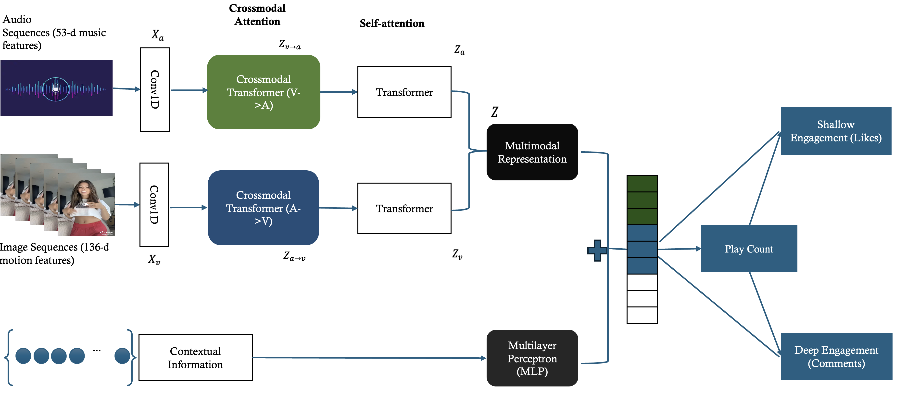

# ABSTRACT

Although short-form dancing videos are rapidly emerging as a dominant format for both entertainment and marketing on social media platforms, there is a lack of systematic dance video quality measures that can guide influencers in crafting more impactful content and empower brands to predict multifaceted consumer engagement. In this study, we introduce a novel, deep learning-based measure called Music-Motion Synergy (MM Synergy) to assess the quality of dancing videos shared on social media. To develop this measure, we propose a new Context-Aware Multi-Task Multimodal Transformer (CA-MulT-MTL) model. Our model addresses four key challenges, including: (1) capturing core dancing content with sequential unstructured data on audio and body movement, (2) understanding the interactions between multimodal elements, (3) simultaneously predict diverse engagement metrics that reflect management-relevant objectives, and (4) incorporating contextual video information. We instantiate our CA-MulT-MTL model based on a sample of 79, 588 short-form dancing videos on TikTok and find it outperforms state-of-the-art deep learning benchmark models. Our model-derived MM Synergy scores are validated by human ratings and informative of consumer responses to video content. Furthermore, through an online controlled experiment, we establish the causal impact of MM Synergy levels on consumers’ video watch intention, purchase intention, and the probability of liking. Our scalable machine learning method serves as a useful decision-support tool for influencers to develop popular dance videos and empowers platforms to not only leverage MM Synergy as a quality control tool prior to publishing videos but also embed it into recommendation systems to enhance business outcomes and customer experiences.

## Feature Extraction

<div style="display: flex; align-items: center; justify-content: center;">
     <div>
        <video width="300" controls>
            <source src="assets/videos/raw_video.mp4" type="video/mp4">
            Your browser does not support the video tag.
        </video>
        <p style="text-align: center; font-weight: bold;">Raw Video Example</p>
    </div>
    <div style="margin-right: 20px;">
        
        <p style="text-align: center; font-weight: bold;">Feature Extraction Flow</p>
    </div>
    <div>
        <video width="300" controls>
            <source src="assets/videos/alphapose.mp4" type="video/mp4">
            Your browser does not support the video tag.
        </video>
        <p style="text-align: center; font-weight: bold;">Body and Face Landmarks Visualization</p>
    </div>
</div>

## Model Architecture

<div style="text-align: center;">
  
</div>

## Model Performance

<div style="text-align: center;">
  
</div>

## Experiments
<style>
  .video-container {
    display: flex;
    justify-content: center;
    gap: 20px; /* Space between videos */
    flex-wrap: wrap;
  }
  .video-container figure {
    text-align: center; /* Centers text below videos */
    width: 40%; /* Adjust width as needed */
  }
  .video-container video {
    width: 80%;
  }
</style>

<div class="video-container">
  <figure>
    <video controls>
      <source src="assets/6843971599771733254_H.mp4" type="video/mp4">
      Your browser does not support the video tag.
    </video>
    <figcaption><strong>Video 1: (High MM Synergy Condition)</strong></figcaption>
  </figure>

  <figure>
    <video controls>
      <source src="assets/H1_Low.mp4" type="video/mp4">
      Your browser does not support the video tag.
    </video>
    <figcaption><strong>Video 1: (Low MM Synergy Condition)</strong></figcaption>
  </figure>
</div>

<div class="video-container">
  <figure>
    <video controls>
      <source src="assets/videos/7063140508113145094_H.mp4" type="video/mp4">
      Your browser does not support the video tag.
    </video>
    <figcaption><strong>Video 2: (High MM Synergy Condition)</strong></figcaption>
  </figure>

  <figure>
    <video controls>
      <source src="assets/videos/H4-manipulated.mp4" type="video/mp4">
      Your browser does not support the video tag.
    </video>
    <figcaption><strong>Video 2: (Low MM Synergy Condition)</strong></figcaption>
  </figure>
</div>

<div class="video-container">
  <figure>
    <video controls>
      <source src="assets/videos/7237098875046087942_H.mp4" type="video/mp4">
      Your browser does not support the video tag.
    </video>
    <figcaption><strong>Video 3: (High MM Synergy Condition)</strong></figcaption>
  </figure>

  <figure>
    <video controls>
      <source src="assets/videos/H3_manipulated.mp4" type="video/mp4">
      Your browser does not support the video tag.
    </video>
    <figcaption><strong>Video 3: (Low MM Synergy Condition)</strong></figcaption>
  </figure>
</div>

<div class="video-container">
  <figure>
    <video controls>
      <source src="assets/videos/6826850615004515590_H.mp4" type="video/mp4">
      Your browser does not support the video tag.
    </video>
    <figcaption><strong>Video 4: (High MM Synergy Condition)</strong></figcaption>
  </figure>

  <figure>
    <video controls>
      <source src="assets/videos/H5_manipulated.mp4" type="video/mp4">
      Your browser does not support the video tag.
    </video>
    <figcaption><strong>Video 4: (Low MM Synergy Condition)</strong></figcaption>
  </figure>
</div>

<div class="video-container">
  <figure>
    <video controls>
      <source src="assets/videos/6943205179202211074_H.mp4" type="video/mp4">
      Your browser does not support the video tag.
    </video>
    <figcaption><strong>Video 5: (High MM Synergy Condition)</strong></figcaption>
  </figure>

  <figure>
    <video controls>
      <source src="assets/videos/H2_manipulated.mp4" type="video/mp4">
      Your browser does not support the video tag.
    </video>
    <figcaption><strong>Video 5: (Low MM Synergy Condition)</strong></figcaption>
  </figure>
</div>


```
Long, single-line code blocks should not wrap. They should horizontally scroll if they are too long. This line should be long enough to demonstrate this.
```

```
The final element.
```
